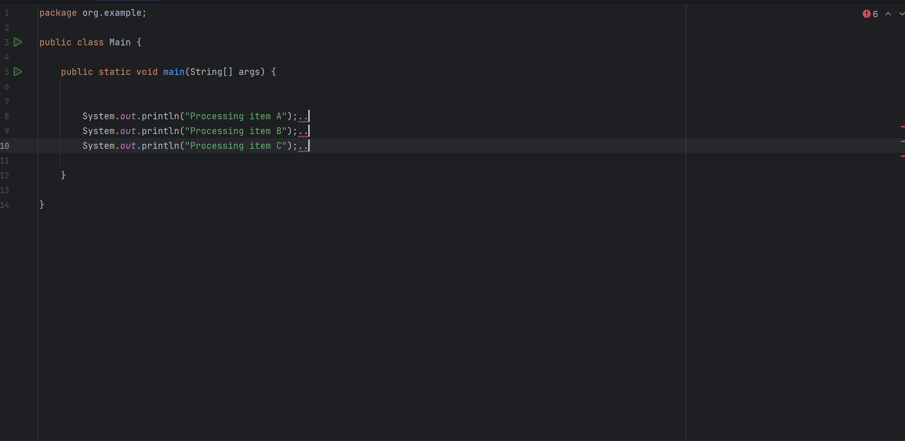
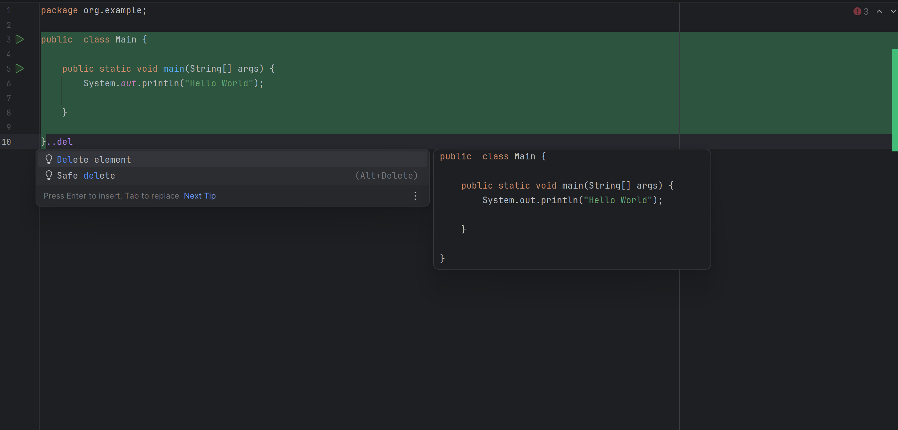
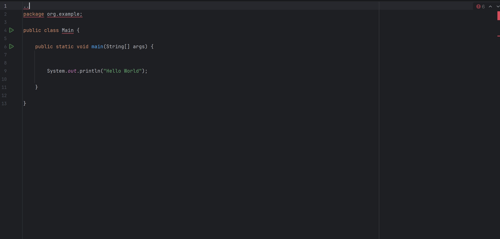

# IntelliJ IDEA Java Subsystems Test Coverage

**Candidate:** Mateusz Duda
**Date:** 4.05.2026
**Environment:** IntelliJ IDEA 2026.1.2 Preview (Build #IU-261.24374.34), Windows 11
**Feature Tested:** Command Completion (Java)

---

## Feature Overview

Command Completion is a new IntelliJ IDEA feature that integrates IDE actions directly into the editor's code completion popup. By typing `..` (double dot), users can access a filtered list of context-aware IDE commands (such as refactorings, code generation, and formatting) without leaving the editor or memorizing keyboard shortcuts. Commands also appear alongside regular suggestions when typing `.` (single dot) after an identifier. The feature uses fuzzy search and adapts its suggestions based on the current cursor context (e.g., method body, class level, string literal).

---

## 1. Testing Scope & Strategy

To thoroughly evaluate the new Command Completion feature, I performed exploratory testing focused on the following core areas:
*   **Triggering & UI:** Validating how the feature is invoked (`.` vs `..`), fuzzy search capabilities, command ranking/prioritization, and UI responsiveness.
*   **Context Awareness:** Ensuring that IDE commands are only suggested when syntactically and logically appropriate (e.g., class level vs. method body vs. strings/comments).
*   **Action Execution:** Verifying that diverse command types (reformatting, refactoring, generation, surrounding) perform their intended actions without side effects and can be cleanly undone.
*   **Edge Cases:** Testing behavior in incomplete code, multiple carets, empty files, and edge-case contexts.

---

## 2. Documented Test Cases

Below is a selection of test cases demonstrating the common mechanisms of the feature.

### 2.1 Triggering & UI Behavior

| ID        | Title                                       | Context/Preconditions                                                                                                         | Steps to Reproduce                                                                                                    | Expected Result                                                                                                                                          | Pass/Fail |
|:----------|:--------------------------------------------|:------------------------------------------------------------------------------------------------------------------------------|:----------------------------------------------------------------------------------------------------------------------|:---------------------------------------------------------------------------------------------------------------------------------------------------------|:----------|
| **TC-01** | Filter commands using `..`                  | Cursor is inside an empty method body.                                                                                        | 1. Type `..`                                                                                                          | Popup opens displaying *only* IDE commands (no Java methods/variables).                                                                                  | Pass      |
| **TC-02** | Fuzzy search functionality                  | Cursor is inside a method body.                                                                                               | 1. Type `..form`                                                                                                      | The "Reformat Code" command is accurately filtered to the top of the list.                                                                               | Pass      |
| **TC-03** | Single-dot (`.`) mixed completion           | A variable `list` of type `ArrayList` exists. Cursor is after `list` in a method body.                                       | 1. Type `.`                                                                                                           | The popup shows *both* regular Java method suggestions (e.g., `.add()`, `.size()`) *and* IDE command actions intermixed or in a separate section. | Pass      |
| **TC-04** | Command ranking changes by context          | Cursor is inside a method body with a selected expression `a + b`.                                                            | 1. Select the expression `a + b`. 2. Type `..`                                                                     | Context-relevant commands (e.g., "Extract Variable", "Extract Method") are ranked at the top of the list, above generic commands like "Reformat".        | Pass      |
| **TC-05** | Dismissing the popup (Escape)               | Cursor is anywhere in the file.                                                                                               | 1. Type `..` to open the popup. 2. Press `Esc` on the keyboard.                                                    | The popup closes immediately without modifying the code, and the cursor remains in place.                                                                | Pass      |
| **TC-06** | Disabling via Settings                      | 1. Go to `Settings -> Editor -> General -> Code Completion`. 2. Uncheck "Enable command completion". 3. Apply settings. | 1. Return to the editor. 2. Type `..`                                                                              | The Command Completion popup does not appear, and the IDE simply types literal `..` characters.                                                          | Pass      |

### 2.2 Context Awareness

| ID        | Title                                       | Context/Preconditions                                                                                                         | Steps to Reproduce                                                                                                    | Expected Result                                                                                                                                     | Pass/Fail    |
|:----------|:--------------------------------------------|:------------------------------------------------------------------------------------------------------------------------------|:----------------------------------------------------------------------------------------------------------------------|:----------------------------------------------------------------------------------------------------------------------------------------------------|:-------------|
| **TC-07** | Context isolation: Class level              | Cursor is inside a class body but outside any method.                                                                         | 1. Type `..`                                                                                                          | Commands like "Extract Variable" are hidden. "Generate Getter" is visible.                                                                          | Pass         |
| **TC-08** | Context isolation: Strings                  | Cursor is inside a string literal `""`.                                                                                       | 1. Type `..`                                                                                                          | Code modifying commands are hidden. Only general/string commands are shown.                                                                         | Pass         |
| **TC-09** | Language Injection context                  | Cursor is inside a String literal that has an injected language (like SQL or JSON).                                           | 1. Place cursor inside the SQL/JSON string. 2. Type `..`                                                           | The completion list should prioritize commands relevant to the injected language, not just Java context.                                            | Pass         |
| **TC-10** | Read-only file context                      | File is a compiled `.class` file from an external library (read-only).                                                        | 1. Open the file. 2. Type `..`                                                                                     | Code-modifying commands (like `..rename`, `..reformat`) should **not** be available, as the file cannot be edited.                                  | Pass         |
| **TC-11** | Empty file / Out-of-bounds context          | File is completely empty OR cursor is placed above the `package` declaration.                                                 | 1. Type `..` at the top of the file.                                                                                  | Only generic, file-level commands should appear.                                                                                                    | Fail (Popup fails to trigger entirely; nothing happens). |

### 2.3 Action Execution & Undo

| ID        | Title                                     | Context/Preconditions                                                                                                         | Steps to Reproduce                                                                                                    | Expected Result                                                                                                                                      | Pass/Fail                                                 |
|:----------|:------------------------------------------|:------------------------------------------------------------------------------------------------------------------------------|:----------------------------------------------------------------------------------------------------------------------|:-----------------------------------------------------------------------------------------------------------------------------------------------------|:----------------------------------------------------------|
| **TC-12** | Reformat: Successful execution & Undo     | File has poorly formatted code.                                                                                               | 1. Execute `..reformat` 2. Press `Ctrl+Z` (Undo).                                                                  | Code formats successfully. Undo reverts the entire action in a single step.                                                                          | Pass                                                      |
| **TC-13** | Extract Method via Command Completion     | A method body contains a block of 3+ lines of extractable code (e.g., a calculation with local variables).                   | 1. Select the block of code. 2. Type `..extract method`. 3. Provide a name and confirm.                         | The selected code is extracted into a new private method. The original code is replaced by a call to the new method. `Ctrl+Z` undoes the extraction. | Pass                                                      |
| **TC-14** | Introduce Constant via Command Completion | A method contains a repeated expression like `list.size() * 2`.                                                              | 1. Place cursor on or select the expression `list.size() * 2`. 2. Type `..introduce constant`. 3. Confirm name. | A new constant is created holding the expression value. All occurrences are replaced with the constant name. Undo reverts cleanly.                   | Pass                                                      |
| **TC-15** | Surround with try-catch                   | A method body contains a statement that throws a checked exception (e.g., `new FileInputStream("test.txt")`).               | 1. Place cursor on the throwing statement. 2. Type `..surround with try`. 3. Select "Surround with try/catch".  | The statement is wrapped in a `try-catch` block with the correct exception type. Undo removes the surrounding block cleanly.                         | Pass                                                      |
| **TC-16** | Rename refactoring via Command Completion | A Java class has a field `private int count;` used in multiple methods.                                                       | 1. Place cursor on `count`. 2. Type `..rename`. 3. Change the name to `total` and confirm.                      | All usages of `count` across the file (and project) are updated to `total`. Undo (`Ctrl+Z`) reverts all changes atomically.                          | Pass                                                      |
| **TC-17** | Generate equals/hashCode                  | Cursor is inside a class body (outside methods) with 2+ fields declared.                                                     | 1. Type `..generate equals`. 2. Select fields and confirm.                                                         | `equals()` and `hashCode()` methods are generated correctly using the selected fields. Undo removes them cleanly.                                    | Pass                                                      |
| **TC-18** | Undo (Ctrl+Z) after executing 'Delete'    | A Java file is open in the editor.                                                                                            | 1. Type `..`  2. Select and execute the `Delete element` command. 3. Attempt to press `Ctrl+Z` to undo.         | The command deletes text/lines, and `Ctrl+Z` successfully restores the deleted text within the editor.                                               | Fail (Deletes entire file and breaks editor undo history) |

### 2.4 Edge Cases

| ID        | Title                                       | Context/Preconditions                                                                                                         | Steps to Reproduce                                                                                                    | Expected Result                                                                                                                                     | Pass/Fail |
|:----------|:--------------------------------------------|:------------------------------------------------------------------------------------------------------------------------------|:----------------------------------------------------------------------------------------------------------------------|:----------------------------------------------------------------------------------------------------------------------------------------------------|:----------|
| **TC-19** | Multi-caret interaction                     | File contains multiple lines of code.                                                                                         | 1. Use `Alt+Click` to place 3 carets on 3 different lines. 2. Type `..` 3. Select `..comment with line comment` | The completion popup appears, and executing the command comments out all 3 lines simultaneously without crashing.                                   | Fail      |
| **TC-20** | Heavy syntax errors                         | File has severely broken Java syntax (missing braces, semicolons).                                                            | 1. Delete several closing braces `}` to break the syntax tree. 2. Type `..` anywhere in the file.                  | The IDE should not throw an internal exception. Command completion should still gracefully offer basic file-level commands.                         | Pass      |
| **TC-21** | Single-dot vs double-dot conflict           | Cursor is at the end of an object reference, e.g., after `System.out`.                                                       | 1. Type `.` — observe regular completion. 2. Quickly type another `.` (making `..`).                               | The popup transitions from regular code completion to Command Completion mode without visual glitches, flickering, or duplicate popups.             | Pass      |

---

## 3. Bug Reports

### Bug 1: Command Completion popup fails to trigger in multi-caret mode
*   **Severity:** Medium
*   **Related Test Case:** TC-19
*   **Preconditions:** "Enable command completion" is checked in Settings.
*   **Steps to Reproduce:**
    1. Open any Java file.
    2. Use `Alt+Click` to place 3 active carets on 3 different lines of code.
    3. Type `..` on the keyboard.
*   **Expected Result:**
    The Command Completion popup should appear, allowing the user to select an action (like "Comment with Line Comment") to be applied simultaneously to all caret locations.
*   **Actual Result:**
    The Command Completion popup does not appear at all. The IDE simply types the literal `..` characters into the code at all caret locations, making the feature unusable in multi-caret mode.

 

---

### Bug 2: 'Delete' command executes File-Level deletion instead of Editor-Level, breaking Undo history
*   **Severity:** Major
*   **Related Test Case:** TC-18
*   **Preconditions:** Have a Java file open with some code written inside it.
*   **Steps to Reproduce:**
    1. Place the cursor anywhere inside the editor.
    2. Type `..` to open Command Completion.
    3. Search for and execute the `Delete` command.
    4. Attempt to press `Ctrl+Z` to undo the action.
*   **Expected Result:**
    The command should perform a text-level deletion (e.g., delete the current line or highlighted text), and `Ctrl+Z` should revert it. Alternatively, project-level destructive commands should not appear in the editor completion context.
*   **Actual Result:**
    The command triggers a project-level "Safe Delete," which deletes the entire physical `.java` file from the disk. The editor tab immediately closes, which destroys the editor's Undo history, making `Ctrl+Z` unresponsive and potentially causing data loss panic for the user.
*   **Note:** It is worth considering whether this is an intentional mapping to the "Safe Delete" refactoring action. However, even if the action itself is by-design, its appearance in the editor's Command Completion context is misleading — a user typing `..delete` in the editor reasonably expects an editor-level text deletion, not a project-level file operation. At minimum, the command label in the popup should clearly indicate "Safe Delete (file)" to avoid ambiguity, or the action should be excluded from the Command Completion context entirely.

  

---

### Bug 3: Command Completion fails to trigger in empty files or outside class structures
*   **Severity:** Minor
*   **Related Test Case:** TC-11
*   **Preconditions:** Have a completely blank `.java` file, or place the cursor above the `package` declaration.
*   **Steps to Reproduce:**
    1. Type `..` at the top of the file.
*   **Expected Result:**
    The Command Completion popup should open and offer generic file-level commands (e.g., "Generate class", "Reformat File", "Add import").
*   **Actual Result:**
    The popup does not appear at all, failing silently. This limits the feature's usability for starting new files.
*   **Note:** This behavior may be by-design, as Command Completion could intentionally require a valid Java scope (class or method body) to determine which commands are contextually relevant. However, even in an empty file, there are valid actions a user might want to perform (e.g., generating a class skeleton, creating a `main` method). The silent failure with no visual feedback makes it unclear whether the feature is unsupported in this context or simply broken. A brief tooltip or status bar message indicating "Command Completion is not available in this context" would improve discoverability and user experience.

 

---

## 4. Proposed Direction for Deeper Testing

Given more time, I would expand the testing scope into the following areas to ensure absolute robustness:

1.  **Performance under Load:** Test command completion in massive Java files (10k+ lines) or deeply nested generic structures to check for UI lag or background thread blocking.
2.  **Plugin Interactions:** Verify compatibility with highly-used structural plugins like IdeaVim or GitHub Copilot, ensuring shortcuts and inline suggestions do not collide.
3.  **Multi-Caret Resilience:** Test behavior when triggering command completion with multiple carets placed across different syntactical scopes (e.g., one caret in a method, another in a field declaration).
4.  **Accessibility (a11y):** Ensure screen readers accurately announce the command list and that keyboard navigation relies strictly on accessible UI components.
5.  **Command Ranking Algorithm:** Systematically verify that the ranking/ordering of commands in the popup adapts correctly to different contexts (selection vs. no selection, different scopes) and that recently-used commands are promoted appropriately.
6.  **Cross-Language Boundary:** Test behavior in files mixing Java with other JVM languages (e.g., Groovy scripts in a Java project) to verify correct feature boundary detection.

---

*Test scenarios were executed against sample Java code in the `src/` directory of this repository.*
